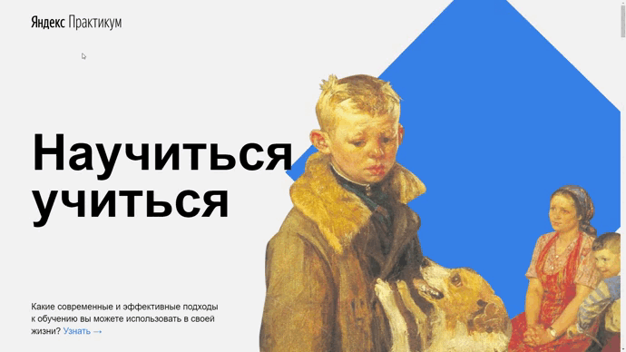

# «Научиться учиться»

## О проекте
Одностраничный сайт, рассказывающий методы обучения. Содержит информацию о некоторых из них с ссылками на полезные ресурсы.
### Функционал:
* Анимация и трансформация элементов страницы посредством CSS
* Секция video с встроенными на страницу видео из Youtube
### Технологический стек:

 

[Ссылка на проект Github Pages](https://natalymaxi.github.io/how-to-learn/)

